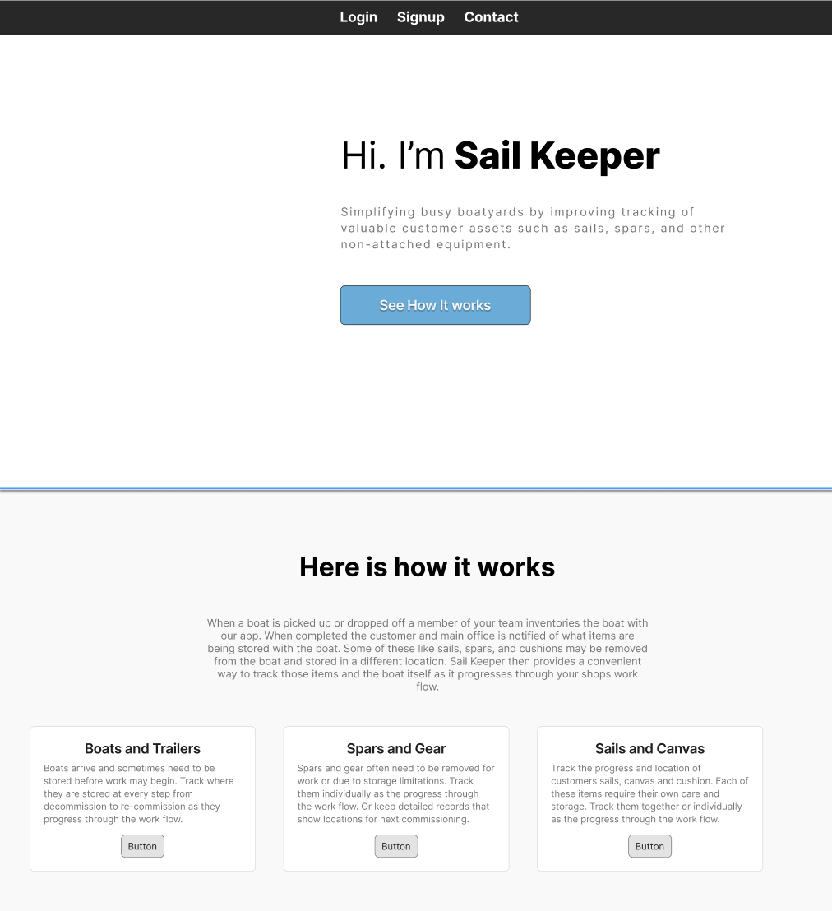

# sailkeeper

## About The Project

Boatyards store a large variety of items related to the boat. During the boating season all these items such as sails, cushions, spars and personal items are stored on the boat. But when the boat is decommissioned at the end of the season often those items are separated from the boat itself. This could be temporary to send a sail or a cushion to be repared, or it could be season long if items are stored away from the boat itself. In the best case some effort is required to coordinate all the items returning to the boat before it is commissioned for the season. In the worst case items end up going missing and do not make it back to the boat when it is commissioned. This results in added expense and headache for the boatyard and loss of valuable boating days for the customer. 

This project aims to ease this problem by creating a platform where stored boats inventory can be recorded at the end of the season during decommissioning, updated as work is preformed, and verified against the following season during commissioning. Additionally coordination will be aided by all workers being able to see the current status and location of items. Lastly customer relationships will be aided due to the customer being aware of what was stored with the boat and what was delivered during commissioning.

### Sreenshot of Landing Page Layout

